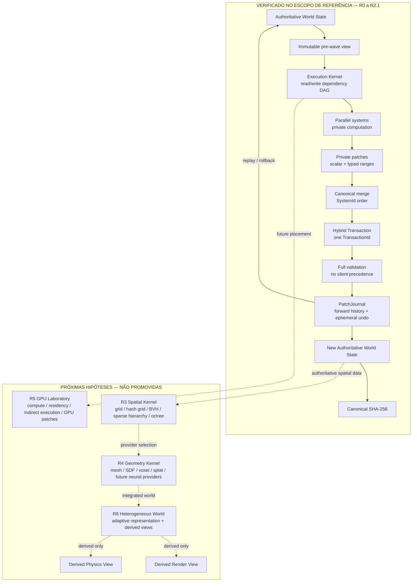

# D-SF — Engine Research Laboratory

> **Estado do repositório:** baseline auditável R0–R2.1.
> **Próxima pesquisa autorizada:** R3 — Spatial Kernel Bake-Off.
> **Contratos `FOUNDATIONAL`:** nenhum.

D-SF é um programa de pesquisa de engenharia para descobrir, por experimentos reproduzíveis, uma arquitetura de motor capaz de maximizar complexidade de mundo e qualidade perceptual por unidade de computação sem tornar o estado autoritativo dependente de uma única representação geométrica, renderer ou classe de processador.

Este repositório é a **fonte oficial única do projeto**. O código R0–R2.1 e os documentos canônicos abaixo foram consolidados a partir exclusivamente do histórico desta conversa e dos artefatos de laboratório produzidos nela. Nenhum outro repositório foi usado como fonte de verdade para este baseline.

## Fontes canônicas

Para evitar documentos concorrentes, somente estes arquivos definem o estado do projeto:

| Documento | Autoridade |
|---|---|
| [`README.md`](README.md) | Entrada, arquitetura resumida, estágio ativo e comandos básicos. |
| [`docs/PROJECT.md`](docs/PROJECT.md) | Intenção original, missão, escopo, regras, roadmap, critérios de promoção e fechamento. |
| [`docs/ARCHITECTURE.md`](docs/ARCHITECTURE.md) | Arquitetura ativa, contratos verificados, invariantes e fronteiras entre núcleos. |
| [`docs/RESEARCH_LEDGER.md`](docs/RESEARCH_LEDGER.md) | Registro cronológico completo das hipóteses, experimentos, correções, decisões e motivos. |
| [`docs/VERIFICATION.md`](docs/VERIFICATION.md) | Evidências reproduzíveis, hashes, benchmarks, ambiente, sanitizers e limitações. |

Relatórios antigos separados de R0/R1/R2/R2.1 não são mantidos como documentos ativos porque duplicariam verdades. Seu conteúdo comprovado foi incorporado ao ledger e ao documento de verificação.

## Regra de evidência

Nenhuma afirmação entra como fato arquitetural somente porque parece plausível. O projeto distingue explicitamente:

- `IDEA`: possibilidade ainda não formulada como teste;
- `HYPOTHESIS`: proposição falsificável e ainda não comprovada;
- `EXPERIMENTAL`: existe implementação de laboratório, ainda livre para mudar;
- `VERIFIED`: passou pelos testes definidos, no escopo explicitamente declarado;
- `FOUNDATIONAL`: contrato versionado que sobreviveu a validação multiplataforma e estresse arquitetural suficiente para ser tratado como fundação estável.

`VERIFIED` nunca significa “universalmente verdadeiro”. Nenhum contrato chegou a `FOUNDATIONAL` até este baseline.

## Arquitetura atual

O diagrama diferencia a parte já demonstrada em R0–R2.1 das próximas camadas de pesquisa.



### Regra central

**A representação visual não é a verdade do mundo.** O estado autoritativo deve continuar válido mesmo que renderer, geometria visual, física ou backend de execução sejam substituídos.

### Fronteira de autoridade atual

```text
Authoritative World
       │
       ▼ immutable snapshot
Execution DAG
       │
       ▼ parallel computation
Private system patches
       │
       ├── scalar writes: estrutura e mudanças esparsas
       └── typed ranges: mudanças agrupadas ou densas
       │
       ▼
Hybrid Transaction
       │
       ▼ validate + canonical publish
New Authoritative World
```

Workers podem calcular propostas em paralelo. **Workers não possuem autoridade para mutar o `World` diretamente.**

## Estado das etapas

| Etapa | Estado | Resultado principal |
|---|---|---|
| R0 — Minimal Authoritative World | `VERIFIED` — reference scope | Estado autoritativo mínimo, identidade estável, transações validadas e baseline CPU. |
| R1 — Journal / Hash / Replay / Rollback | `VERIFIED` — same-architecture reference scope | Um `World` novo reproduz o mesmo SHA-256 apenas com o journal ordenado; rollback retorna a hashes históricos exatos. |
| R2 — Dependency Execution Graph | `VERIFIED` — correctness scope; performance `PARTIAL` | Dependências `read/write` geram waves seguras; serial e worker pool convergem ao mesmo hash. |
| R2.1 — Hybrid Transaction Patches | `VERIFIED` — correctness + tested-performance scope | Scalar + ranges preservam a autoridade e eliminam grande parte do overhead de milhões de `Mutation` em workloads densos. |
| R3 — Spatial Kernel Bake-Off | `HYPOTHESIS / NEXT` | Comparar estruturas espaciais sob a mesma API e workloads, sem escolher vencedora antecipadamente. |

## Resultado integrado mais forte até agora

No workload R2.1 de **1.000.000 de entidades, 4 sistemas, 2 waves e 3 frames**, todos os candidatos produziram o mesmo estado final. A mediana observada no ambiente compartilhado da sandbox foi:

| Caminho | Mediana | Speedup vs R2 scalar serial |
|---|---:|---:|
| R2 scalar serial | 740.970 ms | 1.000× |
| R2 scalar / 4 workers | 517.654 ms | 1.431× |
| R2.1 ranges serial | 228.456 ms | 3.243× |
| R2.1 ranges / 4 workers | 166.262 ms | 4.457× |
| R2.1 ranges / 4 workers + persistent parallel commit | 150.455 ms | 4.925× |

SHA-256 final do cenário:

```text
61d624a0af70729626dafebd3b3bea4cb5a074e625ec7f17ac981f6eef5a2c60
```

Esses valores são **evidência do workload nomeado**, não uma afirmação de desempenho de jogo completo e não são evidência de GPU.

## Build de referência

Requisitos já usados no laboratório:

- CMake 3.31.x no ambiente registrado;
- GCC 14.2 e Clang 17;
- C++23;
- Linux x86-64 para as verificações atuais.

```bash
cmake -S . -B build -DCMAKE_BUILD_TYPE=Release
cmake --build build -j
ctest --test-dir build --output-on-failure
```

Executáveis de laboratório atuais:

```bash
./build/aion_lab
./build/aion_bench 1000000 120
./build/aion_r1_bench 256 5000
./build/aion_r2_tests
./build/aion_r2_bench
./build/aion_r21_tests
./build/aion_r21_execution_tests
./build/aion_r21_bench
./build/aion_r21_sparse_bench
./build/aion_r21_execution_bench
```

O namespace/binários ainda usam o nome interno `aion`, herdado dos artefatos experimentais R0–R2.1. Isso **não é** um contrato arquitetural nem uma decisão definitiva de naming; o baseline preserva o código testado para não introduzir mudança cosmética dentro de uma importação de evidência.

## Limites atuais

Ainda não foi comprovado:

- determinismo bit a bit Windows ↔ Linux;
- x86-64 ↔ ARM;
- execução autoritativa CPU ↔ GPU;
- desempenho real em Vulkan/DX12/GPU;
- política final de floating-point determinism;
- hashing incremental/Merkle em escala;
- rollback comprimido/bounded em escala;
- crash-safe journal recovery;
- estrutura espacial vencedora;
- Geometry Kernel heterogêneo;
- renderer ou physics view de produção.

A sandbox utilizada até R2.1 não expôs uma GPU de produção/Vulkan adequada para medições reais. Números de GPU não serão inferidos ou fabricados.

## Próximo gate

R3 só pode promover uma estrutura espacial depois de comparar candidatos sob a mesma interface, conjunto de workloads e critérios de correção. Nenhuma preferência por octree, BVH, grid, sparse bricks ou combinação será tratada como resultado antes dos testes.

Leia [`docs/PROJECT.md`](docs/PROJECT.md) antes de qualquer alteração arquitetural e registre qualquer nova decisão comprovada em [`docs/RESEARCH_LEDGER.md`](docs/RESEARCH_LEDGER.md).
